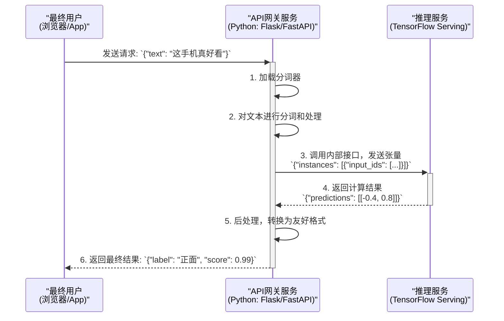

# 中文文本分类（BERT + TensorFlow Serving）

## 项目简介
本项目旨在基于BERT模型进行中文文本分类，最终通过TensorFlow Serving部署模型服务。

## 项目流程

### 1. 环境准备
本项目依赖 `TensorFlow` 和 `Transformers` 等库，建议使用 `pip3` 安装。

```bash
pip3 install -r requirements.txt
```

### 2. 数据集切分
- 原始数据位于 `data/initial.data`，包含 `label` 和 `txt` 两列，以Tab分隔。
- 运行 `split_data.py` 脚本可将其按 8:1:1 的比例切分为训练、验证和测试集。

```bash
# 此脚本依赖 pandas 和 scikit-learn
python3 scripts/split_data.py
```
切分后的文件（`train.data`, `val.data`, `test.data`）将保存在 `data/` 目录下。

### 3. 模型训练
- 使用 `train_bert.py` 脚本进行模型训练。
- 该脚本会加载 `bert-base-chinese` 预训练模型，并在我们的数据集上进行微调。
- 训练完成后，模型将保存在 `saved_model/bert-chinese/` 目录下，并在测试集上输出准确率。

```bash
python3 train_bert.py
```

### 4. 模型导出
- 为了让 TensorFlow Serving 能够加载模型，需要将其转换为标准的 `SavedModel` 格式。
- `export_model.py` 脚本负责此项转换，并为模型定义一个接受原始文本输入的推理接口。

```bash
python3 export_model.py
```
- 导出的模型位于 `tf_serving_model/bert-chinese/1`，其中 `1` 是模型版本号。

### 5. 服务部署
推荐使用 Docker 启动 TensorFlow Serving，这样可以避免复杂的环境依赖问题。
```bash
# 确保Docker已启动
# --name 为容器命名
# -p 将本机的8501端口映射到容器的8501(REST API)
# -v 将本地模型目录挂载到容器的/models目录
# -e 指定要加载的模型名称
docker run -d --name tf-bert-serving -p 8501:8501 \
  -v "$(pwd)/tf_serving_model:/models" \
  -e MODEL_NAME=bert-chinese \
  tensorflow/serving
```
> **为什么要用 Docker？**
> 直接在宿主机上通过 `tensorflow_model_server` 命令启动服务理论上可行，但通常会遇到C++库依赖、版本不匹配等复杂的环境问题。使用官方提供的 `tensorflow/serving` Docker 镜像有以下好处：
> - **环境隔离**: 无需在本地安装任何 TensorFlow Serving 相关的依赖，所有运行时都在容器内，与宿主机环境完全隔离。
> - **版本一致性**: 确保了开发、测试和生产环境的一致性，避免了"在我机器上能跑"的问题。
> - **部署便捷**: 一行命令即可启动、停止和管理服务，极大简化了部署流程。

### 6. 调用服务
`predict_client.py` 脚本演示了如何调用已部署的服务。它会在本地加载分词器，对文本进行预处理，然后向服务发送请求。
```bash
pip3 install requests
python3 predict_client.py
```
成功调用后，会输出预测结果：
```
模型预测结果:
==============================
文本: '这手机拍照真好看，我很喜欢！'
  -> 预测类别: 1 (置信度: 0.9945)
------------------------------
文本: '电池太不耐用了，一天要充好几次电。'
  -> 预测类别: -1 (置信度: 0.9620)
------------------------------
文本: '手机屏幕显示效果还行，中规中矩。'
  -> 预测类别: 1 (置信度: 0.8104)
------------------------------
```

#### API 设计：为什么接口不直接接收文本？
你可能会注意到，无论是`predict_client.py`还是Postman的例子，发送给服务的都不是原始文本，而是一串数字（`input_ids`和`attention_mask`）。这是由TensorFlow Serving的技术特性和业界标准的部署架构决定的。

- **服务器的责任（TF Serving）**：TF Serving是一个高性能的C++程序，它的核心优势是高效的数学计算。但它无法执行像Hugging Face `tokenizer`这样的纯Python逻辑。因此，模型服务本身被设计成一个纯净的"计算器"，它只接受已经处理好的数字张量作为输入。

- **客户端的责任（调用方）**：API的调用方（例如我们的`predict_client.py`）必须承担起所有的预处理工作。一个完整的调用流程如下：
  1.  **加载分词器**：客户端需要加载一个与模型训练时完全相同的分词器（`bert-base-chinese`）。
  2.  **文本分词**：将原始文本（如"这手机真好看"）输入分词器，得到`input_ids`等标记。
  3.  **构造请求**：将分词后的数字数组构造成服务要求的JSON格式。
  4.  **发送请求**：将此JSON作为POST请求的body发送给模型服务。

> 简而言之，**`predict_client.py` 的实现，就是这个服务最精确、最权威的"API文档"**。任何希望集成此服务的应用，都需要遵循这个客户端预处理的流程。项目中提供的`tf_serving_postman_collection.json`文件，仅仅是这个流程走完一次后的"结果快照"，用于快速验证服务是否可用，而不应作为API的接入规范。

## 目录结构
```
bert-chinese-text-classification-tfserving/
  ├── data/
  │   ├── initial.data
  │   ├── train.data
  │   ├── val.data
  │   └── test.data
  ├── scripts/
  │   └── split_data.py
  ├── saved_model/
  │   └── bert-chinese/      # 训练后保存的Hugging Face模型
  ├── tf_serving_model/
  │   └── bert-chinese/
  │       └── 1/             # 导出的TF Serving模型
  ├── train_bert.py
  ├── export_model.py
  ├── predict_client.py
  ├── tf_serving_postman_collection.json
  └── requirements.txt
```
## 常见问题与解决方法 (Troubleshooting)

在开发过程中，我们遇到了一些典型的环境和部署问题，这里记录最终的解决方案。

### 1. 问题：依赖库版本冲突
- **现象**: `ImportError`, `ValueError: numpy.dtype size changed` 等。
- **原因**: `tensorflow`, `tf_keras`, `numpy`, `pandas` 等库之间存在严格的版本依赖。`pip` 在安装或升级某个库时，可能会引入与其他库不兼容的版本。
- **解决方案**:
  1.  当 `tf.keras` 无法导入时，根据提示安装 `tf_keras` (`pip install tf_keras`) 并修改代码。
  2.  当出现 `numpy` 不兼容问题时，通常是 `pandas` 或其他库需要升级 (`pip install --upgrade pandas`) 以匹配新版 `numpy`。
  3.  **最佳实践**: 维护一个稳定的 `requirements.txt` 文件，在新环境中一次性安装所有验证过的依赖版本。

### 2. 问题：模型导出失败或服务无法调用
- **现象**:
  - `export_model.py` 报错 `ValueError` 或 `TypeError`。
  - TensorFlow Serving 返回 `400 Bad Request`，错误信息为 `No OpKernel was registered to support Op 'EagerPyFunc'`。
- **原因**: 这是部署中最核心的问题。`tf.py_function` (以及任何纯Python逻辑，如`tokenizer`) 无法被标准的 TensorFlow Serving C++ 后端执行。我们为了修复导出错误而引入的 `tf.py_function`，恰恰是服务无法识别的操作。
- **解决方案 (标准部署架构)**:
  1.  **服务器只负责纯计算**：将所有预处理/后处理逻辑（如分词）从模型导出代码中完全剥离。导出的 `SavedModel` 应该是一个纯净的计算图，其接口只接受已经处理好的张量（如 `input_ids`）作为输入。
  2.  **客户端负责所有预处理**: 在调用服务的客户端 (`predict_client.py`) 中加载 `tokenizer`，完成从**原始文本 -> 分词 -> 张量**的所有转换工作。然后将这些张量作为请求体发送给 TensorFlow Serving。
  - *这种 "客户端分词" 的架构是业界标准，它不仅解决了技术问题，也使得模型服务本身更轻量、更高效。*

## 生产环境部署架构建议

如果希望提供一个能直接接收原始文本的、稳定且可扩展的API服务，推荐采用以下**微服务架构**：



这种架构将系统分为两个核心服务：

1.  **推理服务 (Inference Service)**
    - **角色**: 本项目中的 `tensorflow/serving` Docker容器。
    - **职责**: 作为一个高效但"单一"的计算引擎，只负责接收处理好的数字张量，执行模型推理，并返回结果。它追求极致的计算性能和稳定性。

2.  **API网关服务 (API Gateway Service)**
    - **角色**: 一个需要额外创建的、轻量级的Python Web服务（例如使用Flask或FastAPI框架）。
    - **职责**: 作为整个系统的"门面"，为最终用户提供友好的API。它负责：
        - 接收原始文本请求。
        - **执行所有预处理逻辑（如分词）**。
        - 调用后端的推理服务。
        - （可选）执行后处理逻辑，将推理结果转换为更易读的格式。

### 采用此架构的优势

- **关注点分离 (Separation of Concerns)**: 每个服务只做自己最擅长的事，使得系统更容易开发、调试和维护。
- **独立扩展 (Scalability)**: 推理服务（通常需要GPU）和网关服务（通常只需要CPU）可以根据各自的负载独立进行扩缩容，从而最大化资源利用率。
- **灵活性 (Flexibility)**: 未来可以轻松替换底层的推理服务（例如从TF Serving换成TorchServe），而对最终用户无任何影响，只需修改网关服务的内部调用逻辑。

