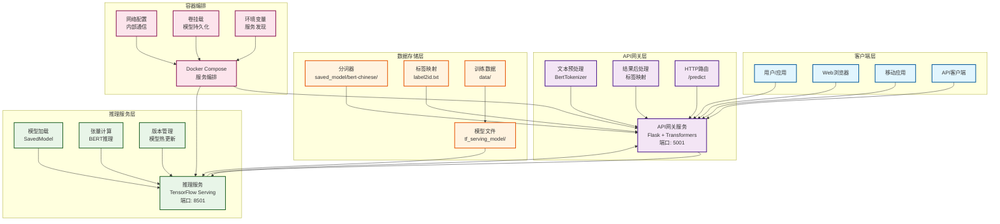
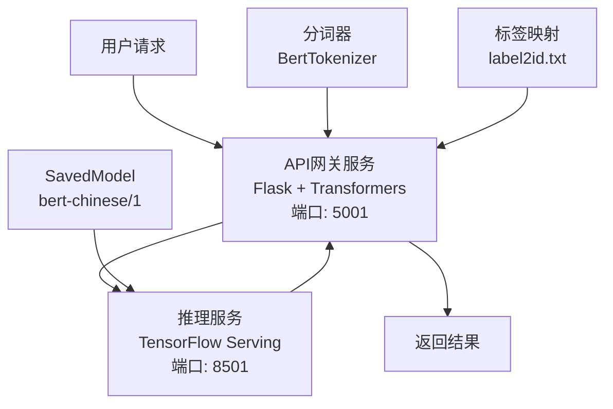
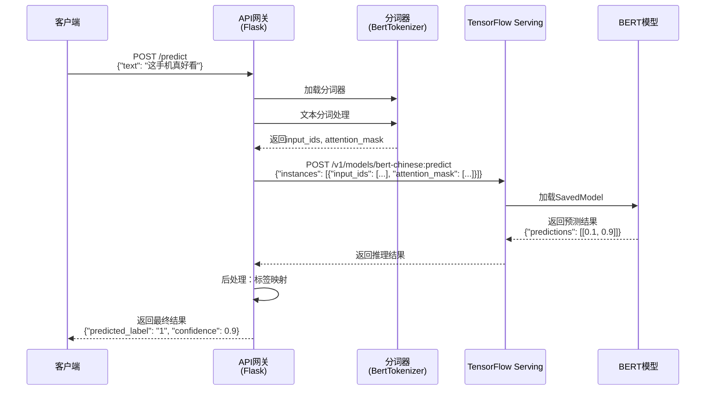
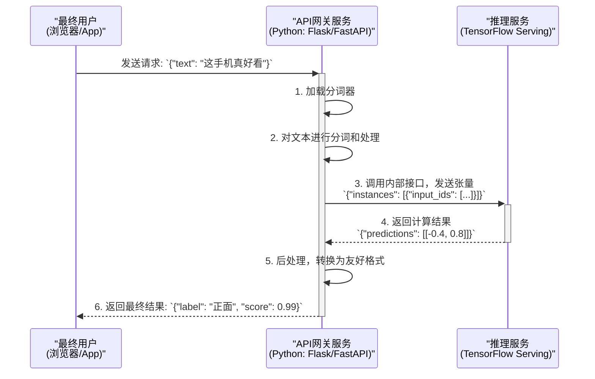

# 中文文本分类（BERT + TensorFlow Serving）

## 项目简介
本项目旨在基于BERT模型进行中文文本分类，最终通过TensorFlow Serving部署模型服务。

## 系统架构

### 整体架构图



### 微服务架构设计
本项目采用微服务架构，将系统分为两个核心服务：



### 数据流转时序图



### 服务职责分工

1. **API网关服务 (api-gateway)**
   - **技术栈**: Python + Flask + Transformers
   - **端口**: 5001
   - **职责**:
     - 接收用户原始文本请求
     - 加载分词器进行文本预处理
     - 将处理后的张量转发给推理服务
     - 解析推理结果并返回友好格式
   - **优势**: 轻量级、易于扩展、支持复杂预处理逻辑

2. **推理服务 (inference-service)**
   - **技术栈**: TensorFlow Serving
   - **端口**: 8501
   - **职责**:
     - 加载SavedModel进行高效推理
     - 接收张量输入，返回预测结果
     - 提供高性能的模型计算
   - **优势**: 高性能、稳定、支持模型版本管理

### 数据流转过程
```
用户文本 → API网关分词 → 张量数据 → TF Serving推理 → 预测结果 → API网关后处理 → 最终响应
```

## 项目流程

### 1. 环境准备
本项目依赖 `TensorFlow` 和 `Transformers` 等库，建议使用 `pip3` 安装。

```bash
pip3 install -r requirements.txt
```

### 2. 数据集切分
- 原始数据位于 `data/initial.data`，包含 `label` 和 `txt` 两列，以Tab分隔。
- 运行 `split_data.py` 脚本可将其按 8:1:1 的比例切分为训练、验证和测试集。

```bash
# 此脚本依赖 pandas 和 scikit-learn
python3 scripts/split_data.py
```
切分后的文件（`train.data`, `val.data`, `test.data`）将保存在 `data/` 目录下。

### 3. 模型训练
- 使用 `train_bert.py` 脚本进行模型训练。
- 该脚本会加载 `bert-base-chinese` 预训练模型，并在我们的数据集上进行微调。
- 训练完成后，模型将保存在 `saved_model/bert-chinese/` 目录下，并在测试集上输出准确率。

```bash
python3 train_bert.py
```

### 4. 模型导出
- 为了让 TensorFlow Serving 能够加载模型，需要将其转换为标准的 `SavedModel` 格式。
- `export_model.py` 脚本负责此项转换，并为模型定义一个接受原始文本输入的推理接口。

```bash
python3 export_model.py
```
- 导出的模型位于 `tf_serving_model/bert-chinese/1`，其中 `1` 是模型版本号。

### 5. 服务部署 (一键启动)
本项目采用 `docker-compose` 来编排和管理应用，实现一键启动包含"API网关"和"推理服务"的完整微服务架构。

```bash
# 确保你已安装 docker 和 docker-compose
# 在项目根目录下运行此命令，它会自动构建并启动所有服务
docker-compose up --build
```
该命令会：
1.  根据 `Dockerfile` 构建一个运行 Flask API 网关的镜像。
2.  拉取 `tensorflow/serving` 镜像作为推理服务。
3.  启动两个容器，并配置好它们之间的网络，使它们可以相互通信。

服务启动后，API 网关将监听 `5001` 端口。

要停止所有服务，请运行:
```bash
docker-compose down
```

### 6. 调用服务
现在，你可以直接向我们新建的 API 网关发送包含原始文本的请求。

```bash
# 使用 curl 测试
curl -X POST http://localhost:5001/predict \
     -H "Content-Type: application/json" \
     -d '{"text": "这手机拍照真好看，我很喜欢！"}'
```
成功调用后，会返回一个易于理解的JSON结果：
```json
{
  "class_id": 2,
  "confidence": 0.99445045,
  "input_text": "这手机拍照真好看，我很喜欢！",
  "predicted_label": "1"
}
```

## API接口文档

### 预测接口
- **URL**: `http://localhost:5001/predict`
- **方法**: POST
- **Content-Type**: application/json

#### 请求格式
```json
{
  "text": "要分类的中文文本"
}
```

#### 响应格式
```json
{
  "class_id": 2,
  "confidence": 0.99445045,
  "input_text": "这手机拍照真好看，我很喜欢！",
  "predicted_label": "1"
}
```

#### 字段说明
- `class_id`: 预测的类别ID（数字）
- `confidence`: 预测置信度（0-1之间）
- `input_text`: 输入的原始文本
- `predicted_label`: 预测的类别标签

#### 错误响应
```json
{
  "error": "错误描述信息"
}
```

### 测试示例
```bash
# 正面情感测试
curl -X POST http://localhost:5001/predict \
     -H "Content-Type: application/json" \
     -d '{"text": "这个产品真的很棒，推荐购买！"}'

# 负面情感测试  
curl -X POST http://localhost:5001/predict \
     -H "Content-Type: application/json" \
     -d '{"text": "质量太差了，不推荐购买。"}'
```

### Postman测试集合
项目提供了完整的Postman测试集合 `postman_collection.json`，包含以下测试用例：

#### 导入方法
1. 打开Postman应用
2. 点击"Import"按钮
3. 选择项目根目录下的 `postman_collection.json` 文件
4. 导入完成后即可看到"BERT中文文本分类API"集合

#### 测试用例分类
1. **文本分类预测**
   - 正面情感测试
   - 负面情感测试  
   - 中性情感测试
   - 长文本测试
   - 短文本测试

2. **错误处理测试**
   - 空文本测试
   - 缺少text字段
   - 无效JSON格式
   - GET方法测试

3. **性能测试**
   - 批量测试用例1-3

#### 自动化测试
集合中包含了自动化测试脚本，会自动验证：
- 状态码是否为200
- 响应时间是否小于2000ms
- 响应格式是否为JSON
- 是否包含必要字段（class_id, confidence, input_text, predicted_label）
- 置信度是否在有效范围内（0-1）

#### 环境变量
集合中配置了以下环境变量：
- `base_url`: http://localhost:5001
- `api_path`: /predict

如需修改服务地址，可以在Postman中编辑这些变量。

## 部署指南

### 环境要求
- Docker 20.10+
- Docker Compose 2.0+
- 至少 4GB 内存
- 至少 10GB 磁盘空间

### 快速部署
1. **克隆项目**
   ```bash
   git clone <repository-url>
   cd bert-chinese-text-classification-tfserving
   ```

2. **准备模型文件**
   - 确保 `saved_model/bert-chinese/` 目录存在（包含训练好的模型）
   - 确保 `tf_serving_model/bert-chinese/1/` 目录存在（包含导出的SavedModel）

3. **启动服务**
   ```bash
   docker-compose up --build -d
   ```

4. **验证服务**
   ```bash
   # 检查服务状态
   docker-compose ps
   
   # 测试API
   curl -X POST http://localhost:5001/predict \
        -H "Content-Type: application/json" \
        -d '{"text": "测试文本"}'
   ```

### 生产环境部署建议
1. **使用反向代理**（如 Nginx）进行负载均衡
2. **配置 HTTPS** 证书
3. **设置监控和日志收集**
4. **配置自动扩缩容**
5. **使用 Docker Swarm 或 Kubernetes** 进行容器编排

### 服务管理
```bash
# 查看服务状态
docker-compose ps

# 查看服务日志
docker-compose logs api-gateway
docker-compose logs inference-service

# 重启服务
docker-compose restart api-gateway

# 停止服务
docker-compose down

# 重新构建并启动
docker-compose up --build -d
```

## 开发指南

### 本地开发环境
1. **安装依赖**
   ```bash
   pip install -r requirements.txt
   ```

2. **启动本地服务**
   ```bash
   # 启动API网关（本地模式）
   python api_gateway.py
   
   # 启动TensorFlow Serving（需要先导出模型）
   tensorflow_model_server --port=8501 --rest_api_port=8501 \
     --model_name=bert-chinese --model_base_path=/path/to/tf_serving_model/bert-chinese
   ```

### 代码结构说明
- `api_gateway.py`: API网关服务，负责文本预处理和结果后处理
- `train_bert.py`: 模型训练脚本
- `export_model.py`: 模型导出脚本
- `predict_client.py`: 独立测试客户端
- `docker-compose.yml`: 服务编排配置
- `Dockerfile`: API网关容器构建文件

### 自定义开发
1. **修改模型**: 编辑 `train_bert.py` 中的模型配置
2. **添加预处理**: 在 `api_gateway.py` 中添加新的预处理逻辑
3. **扩展API**: 在 `api_gateway.py` 中添加新的路由
4. **优化性能**: 调整 Docker 资源配置和模型参数

> `predict_client.py` 脚本仍然可用，它可以用于独立测试后端的推理服务。

#### API 设计：为什么接口不直接接收文本？
你可能会注意到，无论是`predict_client.py`还是Postman的例子，发送给服务的都不是原始文本，而是一串数字（`input_ids`和`attention_mask`）。这是由TensorFlow Serving的技术特性和业界标准的部署架构决定的。

- **服务器的责任（TF Serving）**：TF Serving是一个高性能的C++程序，它的核心优势是高效的数学计算。但它无法执行像Hugging Face `tokenizer`这样的纯Python逻辑。因此，模型服务本身被设计成一个纯净的"计算器"，它只接受已经处理好的数字张量作为输入。

- **客户端的责任（调用方）**：API的调用方（例如我们的`predict_client.py`）必须承担起所有的预处理工作。一个完整的调用流程如下：
  1.  **加载分词器**：客户端需要加载一个与模型训练时完全相同的分词器（`bert-base-chinese`）。
  2.  **文本分词**：将原始文本（如"这手机真好看"）输入分词器，得到`input_ids`等标记。
  3.  **构造请求**：将分词后的数字数组构造成服务要求的JSON格式。
  4.  **发送请求**：将此JSON作为POST请求的body发送给模型服务。

> 简而言之，**`predict_client.py` 的实现，就是这个服务最精确、最权威的"API文档"**。任何希望集成此服务的应用，都需要遵循这个客户端预处理的流程。项目中提供的`tf_serving_postman_collection.json`文件，仅仅是这个流程走完一次后的"结果快照"，用于快速验证服务是否可用，而不应作为API的接入规范。

## 目录结构
```
bert-chinese-text-classification-tfserving/
  ├── data/
  │   ├── initial.data
  │   ├── train.data
  │   ├── val.data
  │   └── test.data
  ├── scripts/
  │   └── split_data.py
  ├── saved_model/
  │   └── bert-chinese/      # 训练后保存的Hugging Face模型
  ├── tf_serving_model/
  │   └── bert-chinese/
  │       └── 1/             # 导出的TF Serving模型
  ├── api_gateway.py                     # 新增：API网关服务
  ├── docker-compose.yml                 # 新增：Docker编排文件
  ├── Dockerfile                         # 新增：API网关的Dockerfile
  ├── export_model.py
  ├── predict_client.py                  # 用于独立测试TF Serving
  ├── train_bert.py
  ├── tf_serving_postman_collection.json # 用于独立测试TF Serving
  └── requirements.txt
```
## 常见问题与解决方法 (Troubleshooting)

在开发过程中，我们遇到了一些典型的环境和部署问题，这里记录最终的解决方案。

### 1. 问题：依赖库版本冲突
- **现象**: `ImportError`, `ValueError: numpy.dtype size changed` 等。
- **原因**: `tensorflow`, `tf_keras`, `numpy`, `pandas` 等库之间存在严格的版本依赖。`pip` 在安装或升级某个库时，可能会引入与其他库不兼容的版本。
- **解决方案**:
  1.  当 `tf.keras` 无法导入时，根据提示安装 `tf_keras` (`pip install tf_keras`) 并修改代码。
  2.  当出现 `numpy` 不兼容问题时，通常是 `pandas` 或其他库需要升级 (`pip install --upgrade pandas`) 以匹配新版 `numpy`。
  3.  **最佳实践**: 维护一个稳定的 `requirements.txt` 文件，在新环境中一次性安装所有验证过的依赖版本。

### 2. 问题：模型导出失败或服务无法调用
- **现象**:
  - `export_model.py` 报错 `ValueError` 或 `TypeError`。
  - TensorFlow Serving 返回 `400 Bad Request`，错误信息为 `No OpKernel was registered to support Op 'EagerPyFunc'`。
- **原因**: 这是部署中最核心的问题。`tf.py_function` (以及任何纯Python逻辑，如`tokenizer`) 无法被标准的 TensorFlow Serving C++ 后端执行。我们为了修复导出错误而引入的 `tf.py_function`，恰恰是服务无法识别的操作。
- **解决方案 (标准部署架构)**:
  1.  **服务器只负责纯计算**：将所有预处理/后处理逻辑（如分词）从模型导出代码中完全剥离。导出的 `SavedModel` 应该是一个纯净的计算图，其接口只接受已经处理好的张量（如 `input_ids`）作为输入。
  2.  **客户端负责所有预处理**: 在调用服务的客户端 (`predict_client.py`) 中加载 `tokenizer`，完成从**原始文本 -> 分词 -> 张量**的所有转换工作。然后将这些张量作为请求体发送给 TensorFlow Serving。
  - *这种 "客户端分词" 的架构是业界标准，它不仅解决了技术问题，也使得模型服务本身更轻量、更高效。*

### 3. 问题：API网关本地加载SavedModel失败
- **现象**:
  - `api_gateway.py` 启动时报错：`module 'keras.layers' has no attribute 'TFSMLayer'` 或 `tf.saved_model.load` 加载模型失败。
  - API接口返回：`{"error": "模型未能成功加载，服务无法使用"}`。
- **原因**:
  - 容器内TensorFlow版本与SavedModel导出版本不兼容，或依赖缺失，或模型结构复杂导致本地加载失败。
  - 实际上，API网关本地加载SavedModel并不是最佳实践。
- **推荐处理方法**:
  1. **API网关只负责分词和预处理，不再本地加载SavedModel**。
  2. **推理时将分词后的张量通过HTTP请求转发给TensorFlow Serving（inference-service）**，由其返回推理结果。
  3. 这样API网关只需加载分词器和标签映射文件，推理流程更清晰、兼容性更好，也符合业界微服务部署标准。
  4. 具体实现可参考本项目最新的`api_gateway.py`，即：
     - 预处理后构造JSON请求体，POST到`http://inference-service:8501/v1/models/bert-chinese:predict`。
     - 解析返回的`class_id`和`probabilities`，再转为最终API响应。

## 生产环境部署架构建议

如果希望提供一个能直接接收原始文本的、稳定且可扩展的API服务，推荐采用以下**微服务架构**：



这种架构将系统分为两个核心服务：

1.  **推理服务 (Inference Service)**
    - **角色**: 本项目中的 `tensorflow/serving` Docker容器。
    - **职责**: 作为一个高效但"单一"的计算引擎，只负责接收处理好的数字张量，执行模型推理，并返回结果。它追求极致的计算性能和稳定性。

2.  **API网关服务 (API Gateway Service)**
    - **角色**: 一个需要额外创建的、轻量级的Python Web服务（例如使用Flask或FastAPI框架）。
    - **职责**: 作为整个系统的"门面"，为最终用户提供友好的API。它负责：
        - 接收原始文本请求。
        - **执行所有预处理逻辑（如分词）**。
        - 调用后端的推理服务。
        - （可选）执行后处理逻辑，将推理结果转换为更易读的格式。

### 采用此架构的优势

- **关注点分离 (Separation of Concerns)**: 每个服务只做自己最擅长的事，使得系统更容易开发、调试和维护。
- **独立扩展 (Scalability)**: 推理服务（通常需要GPU）和网关服务（通常只需要CPU）可以根据各自的负载独立进行扩缩容，从而最大化资源利用率。
- **灵活性 (Flexibility)**: 未来可以轻松替换底层的推理服务（例如从TF Serving换成TorchServe），而对最终用户无任何影响，只需修改网关服务的内部调用逻辑。

